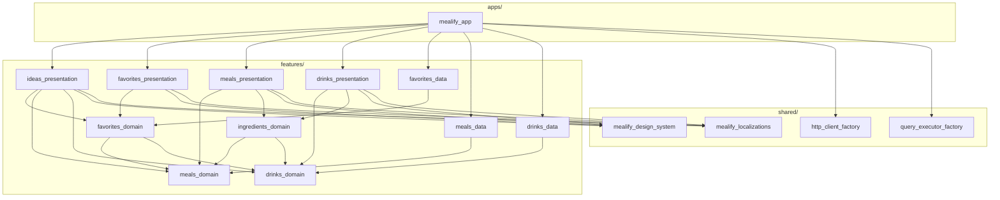

# Mealify

A working Flutter app built as a reference implementation of **Feature-First
Clean Architecture** (FFCA).

Mealify suggests a meal and a cocktail to go with it, and lets you save the pairs
you like. It is a small app on purpose. The point is not the feature set, it is
the structure: 16 packages in a Dart workspace, wired so a feature can be built,
tested, and shipped without reaching into another one.

If you have read the architecture write-up and want to see what it looks like in
running code, this is that. Every convention below is one you can go read.

## Learning more

- [Feature-First Clean Architecture][ffca_link] — the architecture this repo
  implements. Read it for the reasoning; read this repo for the mechanics.
- [Very Good Engineering][vge_link] — more FFCA material is on the way.

This repo deliberately does not restate the architecture page. Where the two
overlap, the page explains *why* and the code here shows *how*.

## Getting started

The Flutter version is pinned in [`.fvmrc`](.fvmrc). With [fvm][fvm_link]
installed:

```sh
fvm install            # creates .fvm/flutter_sdk from .fvmrc
fvm flutter pub get    # resolves the whole workspace at once
```

Then run a flavor:

```sh
fvm flutter run \
  --flavor development \
  --target apps/mealify_app/lib/main_development.dart
```

Repo-wide commands run through [Melos][melos_link], configured under the `melos:`
key in the root [`pubspec.yaml`](pubspec.yaml). It reads the package list from the
same `workspace:` key pub uses, so there is one place to add a package:

| Command | What it does |
| --- | --- |
| `dart run melos test` | Runs the tests of every package that has any |
| `dart run melos analyze` | `dart analyze --fatal-infos` on every package |
| `dart run melos format` | Formats every package |
| `dart run melos format --set-exit-if-changed` | Checks formatting without writing |
| `dart run melos clean` | Clears pub and IDE temp files in every package |

Melos is a dev dependency rather than a global install, so `fvm flutter pub get`
is all the setup there is. Every command uses the `.fvmrc` Flutter version,
because the Melos config points `sdkPath` at `.fvm/flutter_sdk`.

One package on its own:
`cd features/favorites/favorites_domain && fvm flutter test`.

CI runs the same analyze and test steps, plus a license check over all direct and
transitive dependencies.

## The three top-level folders

```
apps/       deployable applications
features/   vertical slices of functionality
shared/     code with no knowledge of any feature
```

**`apps/`** composes features into something shippable. The app owns routing,
flavors, bundle ids, and dependency construction. It is the only place that knows
the full list of features.

**`features/`** holds the functionality. Each feature is a folder of up to three
packages: `{feature}_domain`, `{feature}_data`, `{feature}_presentation`. Not
every feature needs all three.

**`shared/`** holds code that would still make sense in a different app. The rule
is one-directional and absolute: nothing under `shared/` may import anything
under `features/`. When a shared widget needs a feature's data, it declares a
type of its own and the caller maps into it. `DetailsView` takes a list of
`DetailsRow`, and the meal and drink screens map their ingredients into that
shape.

## The dependency graph



Only the presentation packages depend on the design system and localizations;
domain and data packages depend on neither. The two factory packages are used
elsewhere: the app depends on both to build the HTTP client and the database
executors, and the meals and drinks data packages take `http_client_factory` as a
dev dependency for their API client tests.

Three rules produce that shape:

1. **Within a feature, both outer layers point inward.** Data implements what
   domain declares; presentation consumes what domain declares. Neither knows the
   other exists.
2. **Across features, only domains touch.** `favorites_domain` depends on
   `meals_domain` and `drinks_domain`, because a favorite is a meal paired with a
   drink. It does not depend on `meals_data`, and `favorites_presentation` does
   not either.
3. **`shared/` is a leaf.** It depends on external packages and other shared
   packages, never on a feature.

Presentation receives repositories as constructor arguments. Only `mealify_app`
depends on the `_data` packages, because only the app constructs the concrete
implementations and passes them down.

## How a feature fits together

Favorites is the richest slice, so it makes the best worked example. Opening the
favorite details screen runs through these packages in order.

**1. The app resolves the route.** `FavoriteDetailsRoute` in
[`favorites_routes.dart`](apps/mealify_app/lib/app_router/favorites_routes.dart)
builds a `DeferredLoader` that loads the screen's code, then constructs the
module with repositories pulled from `context.read()`.

**2. The module wires dependencies.** `FavoriteDetailsModule` takes three
repository *interfaces*, builds a `GetFavoriteQuery` from them, provides a cubit,
and renders the screen. The module is the feature's entry point, and it names
every dependency it needs in its constructor.

**3. The query combines three repositories.** This is the part worth stealing.
[`GetFavoriteQuery`](features/favorites/favorites_domain/lib/src/use_cases/get_favorite_query.dart):

```dart
final favoriteSummary = await _favoritesRepository.getFavoriteById(favoriteId);

return Favorite(
  id: favoriteId,
  meal: await _mealsRepository.getMealById(favoriteSummary.mealId),
  drink: await _drinksRepository.getDrinkById(favoriteSummary.drinkId),
  createdAt: favoriteSummary.createdAt,
);
```

The favorites data layer can store a favorite, but it has no idea how to fetch a
meal, so it stores ids. `FavoriteSummary` holds a `mealId` and a `drinkId`;
`Favorite` holds a real `Meal` and a real `Drink`. A use case in the domain layer
bridges the two by calling three repositories, and no data layer ever learns
about another feature.

**4. The data layer answers.**
[`FavoritesRepository`](features/favorites/favorites_data/lib/src/repositories/favorites_repository.dart)
implements `IFavoritesRepository` against a Drift database, converting Drift's
generated `DbFavorite` into a `FavoriteSummary` with a converter from
`src/mappers/`. The Drift types never leave the data package.

**5. The cubit emits, the screen switches.** State is a `sealed class` with
loading, success, and error variants, and the screen `switch`es over it, so an
unhandled state is a compile error.

## Package layout

Every layer keeps its implementation under `lib/src/` and exposes barrel files at
`lib/`, so the barrel is the package's public API.

```
{feature}_domain/lib/
  src/models/            domain models, plus {Entity}Summary for id-only forms
  src/repositories/      abstract interface class I{Feature}Repository
  src/use_cases/         Get…Query and …Command classes
  src/extensions/        extensions deriving one model from another
  {feature}_domain.dart

{feature}_data/lib/
  src/data_sources/{source}/       one data source (database, api client)
  src/data_sources/{source}/dtos/  DTOs for that source, parsing generated
  src/mappers/                     DTO -> domain converters
  src/repositories/                repository implementations
  {feature}_data.dart

{feature}_presentation/lib/
  src/{screen}/bloc/                cubit and sealed state
  src/{screen}/views/               screen and widgets
  src/{screen}/{screen}_module.dart the screen's entry point
  {screen}.dart                     subfeature barrel, one per entry point
  {feature}_presentation.dart       primary barrel, re-exports the subfeatures
```

Drift writes its generated DTOs to `{database}.g.dart` beside the database rather
than into a `dtos/` folder.

Naming is mechanical on purpose, so both people and tools can predict where
something lives:

| Thing | Convention | Example |
| --- | --- | --- |
| Package | `{feature}_{layer}` | `favorites_domain` |
| Repository interface | `I{Feature}Repository` | `IFavoritesRepository` |
| Repository implementation | `{Feature}Repository` | `FavoritesRepository` |
| Id-only model | `{Entity}Summary` | `FavoriteSummary` |
| Query | `Get{Entity}Query` | `GetFavoriteQuery` |
| Converter | `{Source}ToDomain{Entity}Converter` | `DbToDomainFavoriteConverter` |
| Cubit | `{Feature}{Screen}Cubit` | `FavoritesListCubit` |
| Module | `{Feature}{Screen}Module` | `FavoritesListModule` |

## The packages

### Application

| Package | What it does |
| --- | --- |
| [`mealify_app`](apps/mealify_app) | The deployable app. Owns routing, flavors, and dependency construction. |

### Features

| Package | Layer | What it does |
| --- | --- | --- |
| [`meals_domain`](features/meals/meals_domain) | domain | The `Meal` model and `IMealsRepository`. |
| [`meals_data`](features/meals/meals_data) | data | Meals from TheMealDB, cached in Drift. |
| [`meals_presentation`](features/meals/meals_presentation) | presentation | The meal details screen. |
| [`drinks_domain`](features/drinks/drinks_domain) | domain | The `Drink` model and `IDrinksRepository`. |
| [`drinks_data`](features/drinks/drinks_data) | data | Drinks from TheCocktailDB, cached in Drift. |
| [`drinks_presentation`](features/drinks/drinks_presentation) | presentation | The drink details screen. |
| [`favorites_domain`](features/favorites/favorites_domain) | domain | `Favorite`, `FavoriteSummary`, and `GetFavoriteQuery`. |
| [`favorites_data`](features/favorites/favorites_data) | data | Favorites in a local Drift database. |
| [`favorites_presentation`](features/favorites/favorites_presentation) | presentation | The favorites list and details screens. |
| [`ingredients_domain`](features/ingredients/ingredients_domain) | domain | Derives an ingredient list from a meal or a drink. Domain-only. |
| [`ideas_presentation`](features/ideas/ideas_presentation) | presentation | The pairing screen. Presentation-only. |

Two of those are shapes worth calling out, because the architecture allows them
and a three-package-per-feature reading would not predict them.
`ingredients_domain` is **domain-only**: TheMealDB returns ingredients as 20 flat
column pairs, and this package turns them into a list, with no storage and no UI.
`ideas_presentation` is **presentation-only**: it owns a screen but no models and
no storage, composing the meals, drinks, and favorites domains instead.

### Shared

| Package | What it does |
| --- | --- |
| [`mealify_design_system`](shared/mealify_design_system) | Feature-agnostic widgets. Names nothing from any feature. |
| [`mealify_localizations`](shared/mealify_localizations) | ARB-driven strings for every feature. |
| [`http_client_factory`](shared/http_client_factory) | Builds the platform-native HTTP client. |
| [`query_executor_factory`](shared/query_executor_factory) | Builds the platform-appropriate Drift executor. |

## Choices worth knowing about

These are the decisions you would otherwise have to reverse-engineer.

**Code splitting is per screen, not per package.** A package with more than one
screen gives each its own barrel, so the app can defer-import one without pulling
in its siblings:

```dart
import 'package:favorites_presentation/favorite_details.dart'
    deferred as favorite_details;
```

A single barrel per package would make deferred loading all-or-nothing. Packages
with one screen (`drinks_presentation`, `ideas_presentation`) do not need a
second barrel, because their primary barrel is already the only entry point.
[`DeferredLoader`](apps/mealify_app/lib/app_router/deferred_loader.dart) wraps the
load and caches the future, so a rebuild does not restart it.

**Every screen rebuilds from its URL alone.** Routes take an id and nothing else.
FFCA allows passing an `$extra` object to skip a loading state; this app
deliberately does not, because `$extra` is empty on a cold-start deep link or a
browser refresh, so the screen has to handle the id-only path anyway. One path is
easier to trust than two.

**Navigation is a callback the app injects.** A feature detects that something
was tapped; the app decides what that means. `IdeasModule` takes `onMealTapped`
and `onDrinkTapped`, and the route passes closures that call generated
`go_router` classes. No feature imports another feature's routes.

**Mapping is hand-written `Converter` classes.** `DbToDomainMealConverter`
extends `Converter<DbMeal, Meal>` from `dart:convert`. FFCA also allows extension
methods or generated mappers; explicit classes were chosen because they are
injectable and directly testable. They stay internal to their data package and
are not exported.

**Localizations are shared, not per-feature.** One `mealify_localizations`
package for the whole app, which is where FFCA suggests starting. Splitting per
feature is a scale decision this app has not needed.

**Melos instead of a Makefile.** This repo used to drive its repo-wide commands
from a `Makefile` that found packages with `find`. Melos reads the same
`workspace:` list pub already resolves, so the package list stopped being a second
thing to maintain. That mattered more than it sounds: the old CI matrix listed its
packages by hand and had drifted, so one package's tests were never running.

Melos is held at 7.8.1 rather than the current 8.x. A pub workspace resolves every
package together, so a dev dependency inherits the whole repo's constraints, and
`drift_dev` and `flutter_test` disagree about `analyzer` in a way that keeps
`cli_util` below what Melos 8 needs. Installing Melos globally would dodge this,
at the cost of a setup step and an unpinned version.

**Cubits, not full Blocs.** With a `sealed` state class, a `switch` in a screen is
exhaustive, so adding a state variant becomes a compile error rather than a blank
screen.

## Contributing

`dart run melos analyze` and `dart run melos test` both need to be green.
[`CLAUDE.md`](CLAUDE.md)
carries the same conventions in a form aimed at coding agents. If you change a
convention, change it in both places.

[ffca_link]: https://verygood.ventures/blog/feature-first-clean-architecture
[vge_link]: https://verygood.ventures/engineering
[fvm_link]: https://fvm.app
[melos_link]: https://melos.invertase.dev
